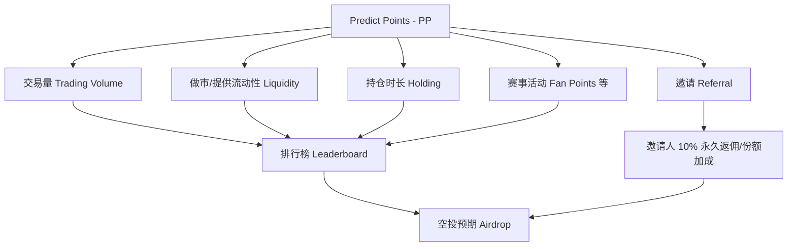
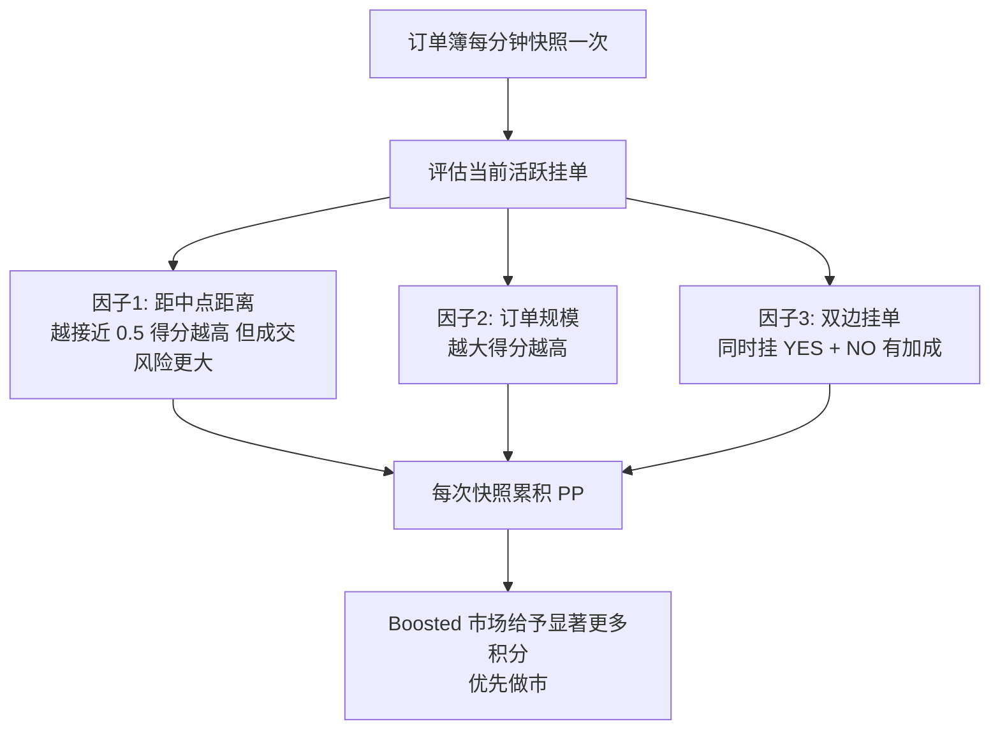
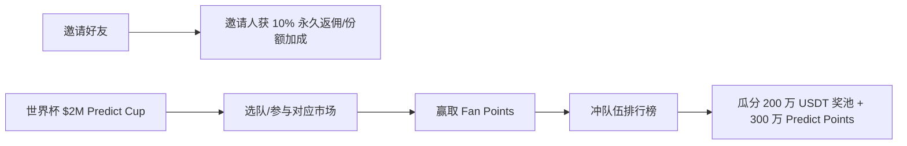
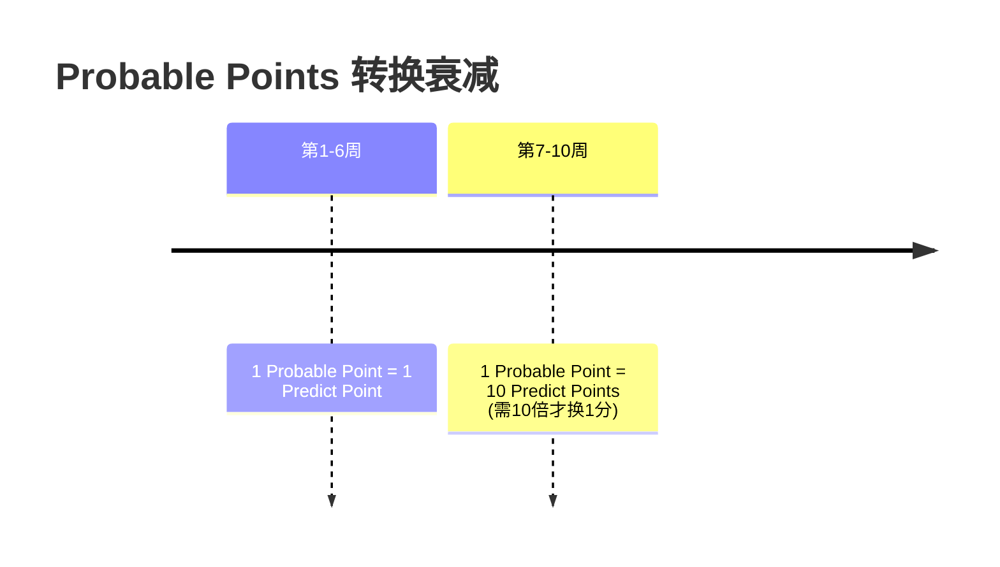
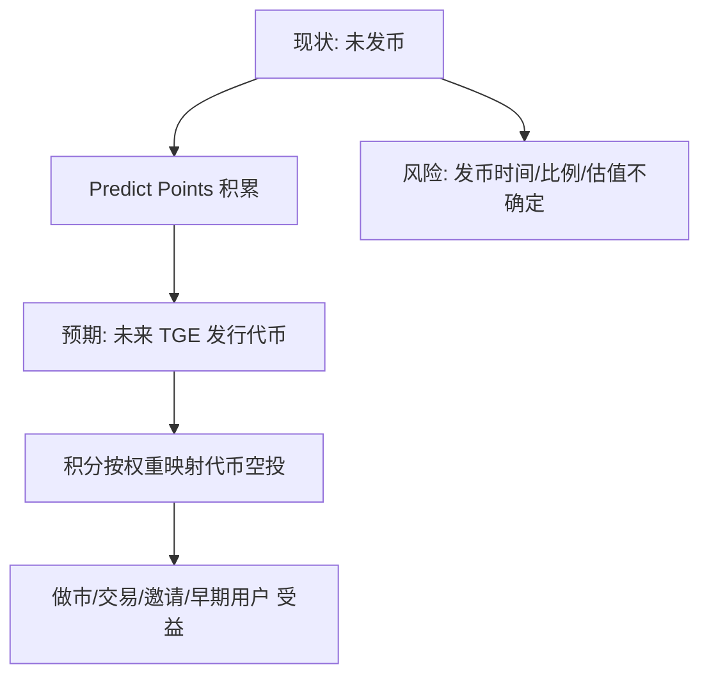

# Predict.fun — 代币 / Predict Points / 空投分析

> 数据日期：2026-06-17
> 平台：predict.fun
> ⚠️ 截至调研时 predict.fun **尚未发行代币**，本文围绕 Predict Points（PP）积分与空投预期展开，代币经济为推断。

---

## 1. 积分体系总览

predict.fun 是当前 **少数（被称为唯一）主动运行积分计划的预测市场**，这使其成为「空投农场」的明确标的。积分来源覆盖：交易量、流动性提供、持仓、邀请、活动。

---

## 2. 做市积分机制（最具特色）

做市积分要点（据第三方分析站 pfanalytics 等）：
- **每分钟对订单簿快照**，活跃挂单在每次快照中计分，出现越多次累积越多。
- **三大计分因子**：① 距中点（midpoint）距离——越近指数级越多分，但被成交风险越高；② 订单规模——越大越多分；③ 双边挂单（YES + NO 同时挂）有加成（注意不是简单 split）。
- **Boosted 市场**给予显著更多积分，应优先挂单。
- 本质是「在风险（被成交）与收益（积分）之间找平衡」的做市游戏。

---

## 3. 邀请与活动

- **邀请**：邀请人获得 **10% 永久** 的费用/份额加成，复利式激励网络增长。
- **大型活动**：2026 世界杯「**$2M Predict Cup**」通过 Binance Wallet 入口，选队参与、赚 Fan Points、冲排行榜，瓜分 **200 万 USDT + 300 万 Predict Points**。3 天内做到 2 万 DAU、18 万笔/日。

---

## 4. Probable 积分迁移

收购 Probable 后，对其老用户提供：
- **2x USDT 手续费返还**；
- **Probable Points → Predict Points 转换**：
  - 第 1–6 周：**1:1**
  - 第 7–10 周：**1:10**（越晚转换越贬值，激励尽快迁移）。

> 设计意图：制造紧迫感，加速 Probable 社区向 predict.fun 迁移并锁定活跃度。

---

## 5. 代币与空投预期（推断）

- **尚未发币**：当前所有激励以 PP 形式发放，市场普遍预期未来 TGE（代币生成事件）时按积分映射空投。
- **YZi Labs 背书 + 唯一积分计划** 被视为「空投潜力大、农场路径清晰」的核心理由。
- **风险**：发币时间、积分→代币的换算比例、初始估值与解锁节奏均不确定；积分通胀（活动大量增发 PP）可能稀释早期用户预期。

---

## 6. 「农场」最优策略要点（基于公开机制总结）

| 策略 | 说明 | 对应积分来源 |
|------|------|-------------|
| 优先 Boosted 市场做市 | 加成市场积分显著更高 | 做市 |
| 双边挂单（YES+NO） | 获得双边加成 | 做市 |
| 平衡距中点与成交风险 | 越近中点分越多但越易被吃 | 做市 |
| 维持交易量 | 量本身计分 | 交易 |
| 邀请扩列 | 10% 永久返佣复利 | 邀请 |
| 参与大型赛事活动 | Fan Points + 奖池 | 活动 |

> ⚠️ 以上为对公开积分机制的客观总结，**不构成投资/收益建议**；空投不保证发生，参与有资金与时间成本。

---

## 7. 小结

predict.fun 的代币/积分策略是典型的 **「积分预埋 + 空投预期」增长引擎**：

1. **唯一在跑积分计划的预测市场**，叠加 YZi/Binance 背书，是市场公认的明确空投标的。
2. **做市积分设计精巧**（每分钟快照 + 三因子计分），直接服务于「冷启动流动性」的核心难题。
3. **邀请 10% 永久返佣 + 大事件奖池**，构成拉新与活跃的强激励。
4. **核心不确定性在 TGE**：积分能否兑现为有价值的代币，是整个增长逻辑能否闭环的关键。
