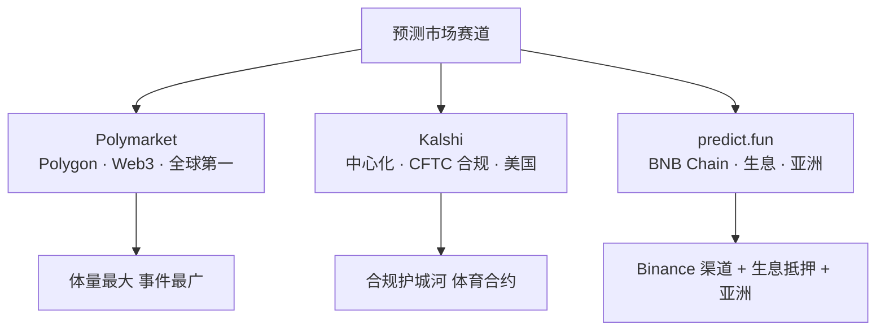
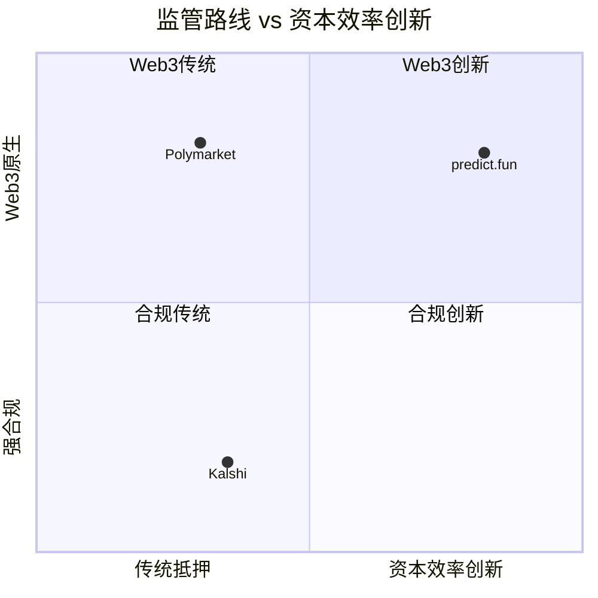
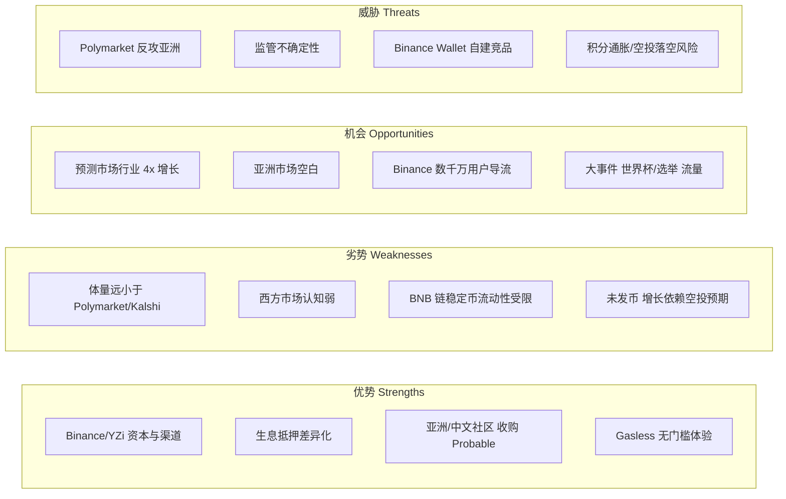
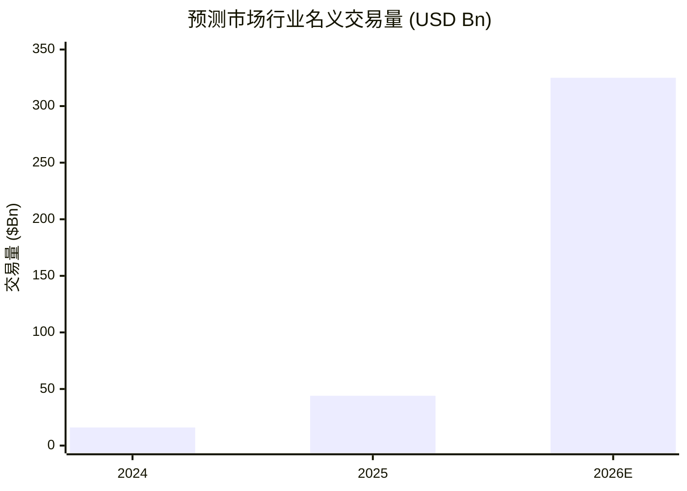

# Predict.fun — 竞争格局分析

> 数据日期：2026-06-17
> 平台：predict.fun

---

## 1. 预测市场三强格局

---

## 2. 三平台横向对比

| 维度 | predict.fun | Polymarket | Kalshi |
|------|-------------|------------|--------|
| 形态 | 链上 Web3 | 链上 Web3 | 中心化合规交易所 |
| 链 | BNB Chain | Polygon | 无（中心化） |
| 监管 | Web3/离岸 | Web3/离岸 | CFTC 合规（美国） |
| 抵押品 | **生息（Yield-Bearing）** | 闲置 USDC | 法币/受监管 |
| 结算 | UMA 兼容乐观预言机 | UMA 乐观预言机 | 内部裁决 |
| 钱包/开户 | Privy 智能钱包 / Binance Keyless | Magic/代理钱包 | KYC 账户 |
| Gas | Binance 代付 / Gasless | 用户承担（低） | 不适用 |
| 重点市场 | 亚洲/中文 | 全球（偏西方） | 美国 |
| 代币 | 未发币（PP 积分） | 未发币 | 未发币（股权融资） |
| 估值/体量参照 | $1.8B+ 累计量 / TVL ~$17M | 估值传闻 ~$150 亿轮谈判 | Series F ~$220 亿估值 |

> 注：估值/体量为不同来源、不同时点的公开口径，仅供量级参考。

---

## 3. 定位差异化矩阵

predict.fun 在「资本效率创新（生息）× Web3 原生」象限独占，避开了与 Polymarket（Web3 传统抵押）和 Kalshi（合规）的正面同质化竞争。

---

## 4. predict.fun 的竞争优劣势

---

## 5. 关键竞争变量

### 5.1 渠道：Binance 是双刃剑
- **正面**：Binance Wallet 原生集成 = 数千万用户的低成本入口，是 Polymarket/Kalshi 都不具备的渠道。
- **风险**：高度依赖 Binance，若 Binance 自建或扶持其他标的，护城河可能松动。

### 5.2 市场：亚洲是错位竞争的关键
- Polymarket/Kalshi 在亚洲（尤其中文区）渗透弱；predict.fun 通过收购 Probable + 岳小鱼任亚太负责人，明确卡位「东方预测市场」。

### 5.3 产品：生息是可被模仿但有先发优势
- 生息抵押在产品叙事上领先，但 Polymarket 等若决心跟进（在合适链上集成生息），技术上可复制；predict.fun 的优势在于「已部署 + 已积累 TVL + 已绑定 BNB DeFi」。

---

## 6. 行业增长背景

- 2025 年行业名义交易量约 **$44B**（CMC 口径，另有 YZi 引用约 $640 亿/4x 的更高口径）。
- 2026 加速：1 月单月 **$26.75B** 创纪录，3 月约 **$25B**；前 86 天 Kalshi $28.3B + Polymarket $24.3B = **$52.7B**，年化约 **$223B**（Artemis）。
- 集中度极高：2025 年 **Kalshi + Polymarket 占约 87.6%**——predict.fun 的存在意义是挑战双寡头、开辟 BNB/亚洲第三极。
- 盈利现实：Polymarket 上仅约 **0.51% 钱包** 盈利超 $1,000（Gate），说明散户更需要「降门槛 + 降成本（生息）」的产品。

> 行业 4x 级增长是 predict.fun 的顺风；但寡头集中度也意味着后发者必须靠差异化（生息）+ 渠道（Binance）+ 区域（亚洲）错位突围。

## 7. 小结

predict.fun 在三强格局中是 **「错位竞争的后发挑战者」**：

1. **不与 Polymarket 拼全球体量、不与 Kalshi 拼合规**，而是用 **「BNB 链 + 生息抵押 + Binance 渠道 + 亚洲市场」** 的组合切入空白。
2. **最大底牌是 Binance 生态**，也最大依赖 Binance 生态。
3. **行业 4x 增长** 是顺风，但能否把「渠道流量 + 空投预期」转化为「真实留存与流动性深度」，是决定其能否从挑战者升格为一极的关键。
