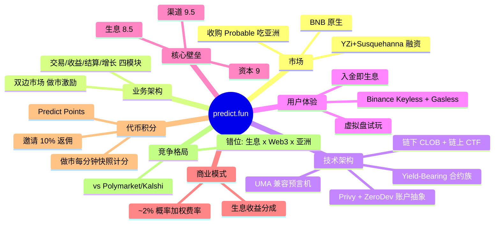
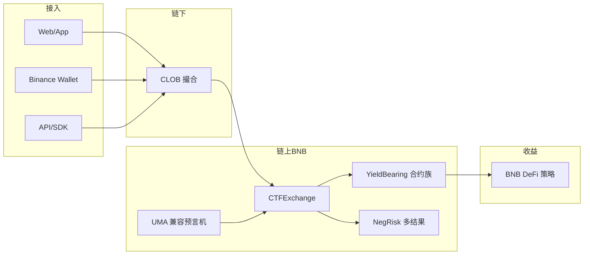
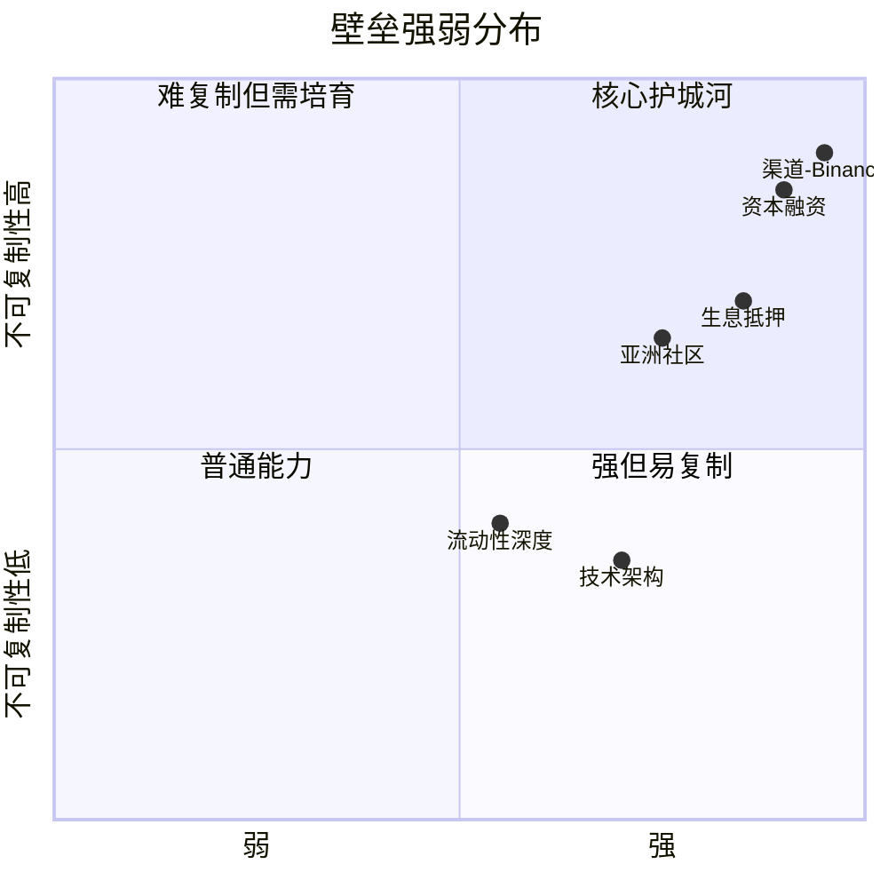
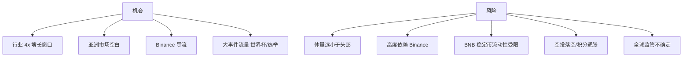

# Predict.fun 全景汇总报告

> 数据日期：2026-06-17
> 数据来源：predict.fun 官网与开发者文档、BNB Chain 链上合约、YZi Labs/Binance 公告、加密媒体

---

## 1. 平台总览

predict.fun 是 **YZi Labs（原 Binance Labs）支持、CZ 公开站台的 BNB Chain 原生预测市场**。它在 Polymarket 式的 CLOB + 条件代币架构之上，叠加了 **生息抵押品（Yield-Bearing Collateral）** 这一核心创新，并通过 **Binance Wallet 原生 Gasless 集成** 与 **亚洲/中文社区**（收购 Probable）实现错位竞争。

| 维度 | 概要 |
|------|------|
| 上线 | 2025-12-16（CZ 12-04 预告） |
| 链 | BNB Chain |
| 机制 | 二元 YES/NO + 多结果，链下 CLOB + 链上 CTF 结算 |
| 结算 | UMA 兼容乐观预言机 |
| 差异化 | 生息抵押（Venus Protocol 路由）+ Binance Gasless + 亚洲市场 |
| 渠道 | Binance Wallet 集成，触达 200M+ 用户 |
| 资本 | YZi Labs 领投/复投、Susquehanna 跟投、CZ 站台 |
| 创始人 | Dingaling（前 Binance 研究负责人、PancakeSwap 联合创始人） |
| 累计量/用户 | $1.8B+ / 130k+ / 4M+ 订单 / $20M+ 资金生息 |
| TVL | ~$16.9M（DefiLlama） |
| 代币 | 未发币（Predict Points 积分 + 空投预期） |

---

## 2. 八大维度速览

---

## 3. 核心发现（TL;DR）

1. **生息抵押品是结构性创新**——链上独立部署的 `YieldBearing*` 合约族佐证「押注期间资金不闲置」，抵押品经 **Venus Protocol** 生息，是当前唯一对闲置抵押提供收益的主要预测市场。
2. **Binance 全家桶背书**——YZi 多次投资、CZ 站台、Binance Wallet 原生 Gasless 集成、创始人前 Binance 背景。
3. **技术是 Polymarket 的 BNB 改良分叉**——CTF + CLOB + UMA 兼容预言机同源，差异在链选、生息、账户抽象。
4. **东方野心明确**——主服务器东京、收购 Probable、岳小鱼任亚太负责人。
5. **积分驱动增长**——Predict Points + 空投预期，做市积分每分钟快照、三因子计分。
6. **大事件渠道飞轮**——世界杯 $2M 奖池 + Binance 入口，3 天 2 万 DAU。

---

## 4. 技术架构一图流

---

## 5. 壁垒画像

---

## 6. 关键趋势与洞察

### 趋势一：资本效率成为预测市场新战场
predict.fun 用「生息抵押」把闲置资金变成收益，开辟了 Polymarket 之外的差异化叙事。资本效率（而非单纯事件覆盖）可能成为下一阶段竞争焦点。

### 趋势二：渠道即护城河（Binance 版）
正如 Polymarket 生态中 Discord/Telegram Bot 验证「嵌入用户已在的平台」最有效，predict.fun 把这一逻辑放大到 **Binance Wallet 数千万用户**——这是西方竞品无法复制的渠道。

### 趋势三：东方市场是错位竞争关键
Polymarket/Kalshi 在亚洲渗透弱，predict.fun 通过收购 + 本地化运营卡位「东方预测市场」。

### 趋势四：积分预埋 + 空投预期驱动冷启动
在发币前用 Predict Points 激励做市与拉新，是加密项目的经典增长打法，成败取决于 TGE 能否兑现预期。

---

## 7. 市场机会与风险

---

## 8. 总结

predict.fun 是预测市场赛道 **资本与渠道最强的后发挑战者**：

1. **差异化清晰**：生息抵押 + Binance Gasless + 亚洲市场，三位一体错位竞争。
2. **资本渠道天花板**：YZi/Susquehanna/CZ 背书 + Binance Wallet 原生入口。
3. **技术稳健**：复用被验证的 Polymarket 架构，叠加生息与账户抽象创新。
4. **核心看点**：能否把「渠道流量 + 空投预期」转化为「真实留存 + 流动性深度 + 可持续代币经济」，决定它能否从挑战者升格为预测市场的第三极。

---

*报告基于公开信息整理，部分数据为合理推断，具体以官方公告为准。不构成投资建议。*
